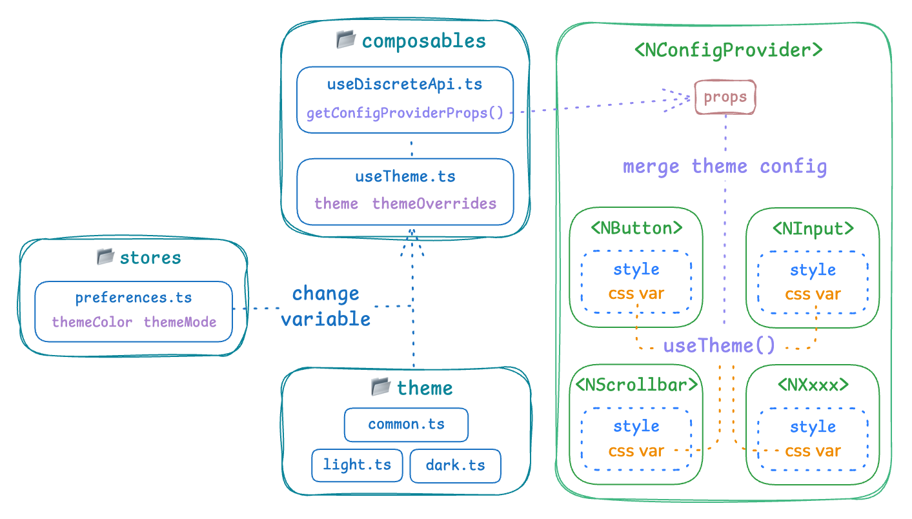
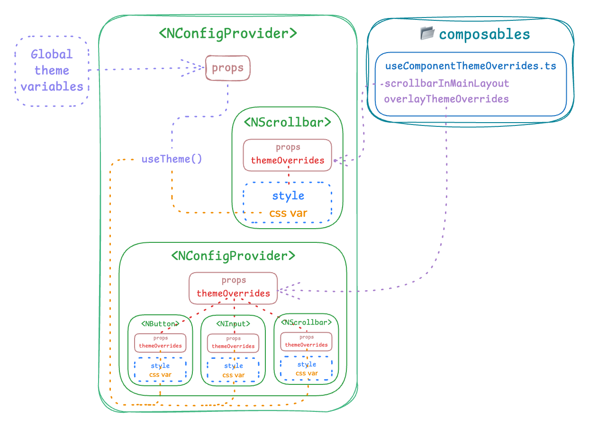

# 主题

**Lithe Admin** 使用 [Tailwind CSS](https://tailwindcss.com/) 原子化框架，并将 Tailwind CSS 颜色板的 `neutral` 作为文字和背景的基色。

## 颜色

在 `src/utils/tailwindColor.ts` 中，分别导出了两种颜色单位（`hex` 和 `oklch`）的数据。这两个颜色的数据由 `src/utils/tailwindColor.test.ts` 中的 `extendTailwindCssColors` 方法生成，内部实现通过 [chroma](https://gka.github.io/chroma.js) 颜色处理库对现有的 Tailwind CSS 的颜色板数据进行计算处理，从而在原有的色阶上做扩展，使其配色效果可以更加细腻。

```ts [src/utils/tailwindColor.ts]
export default {
  slate: {
    '25': '#fbfdfe',
    '50': '#f8fafc',
    '75': '#f4f7fb',
    // ...
  },
  // ...
  neutral: {
    '25': '#f8fafc',
    '50': '#f1f5f9',
    '75': '#e2e8f0',
    // ...
  },
  // ...
}

export const tailwindColorOklch = {
  slate: {
    '25': 'oklch(99.21% 0 247.83)',
    '50': 'oklch(98.4% 0.003 247.858)',
    '75': 'oklch(97.62% 0.01 247.84)',
    // ...
  },
  // ...
  neutral: {
    '25': 'oklch(99.26% 0 0)',
    '50': 'oklch(98.5% 0 0)',
    '75': 'oklch(97.76% 0 0)',
    // ...
  },
  // ...
}
```

::: tip 为什么导出了 `hex` 和 `oklch` 两个颜色单位变量的数据？

因为 `Naive UI` 目前不支持 `oklch` 颜色单位，而 `Tailwind CSS 4.0` 起开始使用 `oklch` 单位。<br/>为了代码的统一性，又提取了一份 `oklch` 单位的颜色数据用于 `tailwind.config.ts` 进行配置。

:::

::: tip 是否可以去掉 `tailwindColorOklch` 数据？

可以，在 `tailwind.config.ts` 中，需要把引入的 `tailwindColorOklch` 变量修改为默认导出。<br/>这不会影响到整体样式，只是新增的色阶颜色样式的单位从 `oklch` 变为 `hex`。

```ts [tailwind.config.ts]
import { tailwindColorOklch } from "./src/utils/tailwindColor"; // [!code --]
import colors from "./src/utils/tailwindColor"; // [!code ++]

// ...

export function extractShades(
  colorObject: Record<keyof typeof tailwindColorOklch, Record<string, string>> // [!code --]
  colorObject: Record<keyof typeof colors, Record<string, string>> // [!code ++]
) {
  // ...

  return result;
}

export default <Config>{
  theme: {
    extend: {
      colors: extractShades(tailwincolorsdColorOklch), // [!code --]
      colors: extractShades(colors), // [!code ++]
    },
  },
};
```

```ts
import { tailwindColorOklch } from "./src/utils/tailwindColor"; // [!code --]
import colors from "./src/utils/tailwindColor"; // [!code ++]

// ...

export function extractShades(
  colorObject: Record<keyof typeof tailwindColorOklch, Record<string, string>> // [!code --]
  colorObject: Record<keyof typeof colors, Record<string, string>> // [!code ++]
) {
  // ...

  return result;
}

export default <Config>{
  theme: {
    extend: {
      colors: extractShades(tailwincolorsdColorOklch),  // [!code --]
      colors: extractShades(colors), // [!code ++]
    },
  },
};
```

::: code-group

```sh [pnpm]
$ pnpm create lithe@latest
```

```sh [npm]
$ npm create lithe@latest
```

```sh [yarn]
$ yarn create lithe@latest
```

```sh [bun]
$ bun create lithe@latest
```

:::

## 配置组件主题变量

在 `src/theme` 目录下

`common.ts` 通用配置，一般用于修改组件的尺寸

```ts [src/theme/common.ts]
import { ccAPCA, cdh } from '@/utils/chromaHelper'
import twc from '@/utils/tailwindColor'

import type { GlobalThemeOverrides } from 'naive-ui'

const BASE = {
  fontWeight: '400',
}

export function commonThemeOverrides(primaryColor = ''): GlobalThemeOverrides {
  return {
    common: {
      actionColor: '',
      borderRadius: '4px',
      primaryColor,
      primaryColorHover: cdh(primaryColor, 0.1),
      primaryColorPressed: cdh(primaryColor, 0.2),
      primaryColorSuppl: primaryColor,
    },
    // ...
  }
}
```

`light.ts` 浅色主题配置

```ts [src/theme/light.js]
// ...

const LIGHT = {
  textColorBase: twc.neutral[800],
  textColor1: twc.neutral[750],
  textColor2: twc.neutral[700],
  textColor3: twc.neutral[500],
  borderColor: twc.neutral[150],
  input: {
    color: twc.neutral[25],
    border: `1px solid ${twc.neutral[200]}`,
  },
}

export function baseLightThemeOverrides(primaryColor = ''): GlobalThemeOverrides {
  return {
    common: {
      textColorBase: LIGHT.textColorBase,
      textColor1: LIGHT.textColor1,
      textColor2: LIGHT.textColor2,
      textColor3: LIGHT.textColor3,
      bodyColor: twc.neutral[25],
      // ...
    },
    // ...
  }
}
```

`dark.ts` 深色主题配置

```ts [src/theme/dark.vue]
// ...

const DARK = {
  baseColor: twc.neutral[250],
  textColorBase: twc.neutral[250],
  textColor1: twc.neutral[350],
  textColor2: twc.neutral[350],
  textColor3: twc.neutral[450],
  borderColor: twc.neutral[800],
  input: {
    color: twc.neutral[800],
    border: `1px solid ${twc.neutral[750]}`,
  },
}

export function baseDarkThemeOverrides(primaryColor = ''): GlobalThemeOverrides {
  return {
    common: {
      baseColor: DARK.baseColor,
      textColorBase: DARK.textColorBase,
      textColor1: DARK.textColor1,
      // ...
    },
    // ...
  }
}
```

主题变量配置通过修改 `NConfigProvider` 全局化配置组件的 `themeOverrides` 属性，对包裹的组件进行主题变量覆盖，更多信息参见[调整主题](https://www.naiveui.com/zh-CN/dark/docs/customize-theme)。

在下面的主题配置结构图中，`composables/useTheme.ts` 组合式函数通过 `stores/preferences.ts` 的**主题颜色**（`themeColor`）和**主题模式**（`themeMode`）作为参数，传入获取主题配置方法，返回对应的主题变量数据。

最后通过 `composables/useDiscreteApi.ts` 的 `getConfigProviderProps()` 方法返回对应的 `props` 数据传递给 `NConfigProvider` 全局化配置组件。



## 单独配置组件主题变量

在一些布局中，我们可能需要单独配置组件的主题变量，比如 `NModal`、`NDrawer`、`NScrollbar` 等一些组件包裹的内容背景色与页面主体颜色不一样，特别是在 `dark` 暗色主题模式下，组件之间的颜色对比度不够明显，这时候组件主题变量需要单独配置。

在 `composables/useComponentThemeOverrides` 组合式函数中，我们重新声明了一些组件的主题变量，在使用的时候再传入组件的 `themeOverrides` 属性进行主题变量覆盖。

```ts [src/composables/useComponentThemeOverrides.ts]
export function useComponentThemeOverrides() {
  // 主布局下的滚动条主题变量
  const scrollbarInMainLayout = computed<GlobalThemeOverrides['Scrollbar']>(() => {
    return {
      // ...
    }
  })

  // 弹窗、抽屉等遮罩层下包裹的组件主题变量
  const overlayThemeOverrides = computed<GlobalThemeOverrides>(() => {
    return {
      // ...
    }
  })
}
```

在 `vue` 文件中使用

```vue
<script setup lang="ts">
import { useComponentThemeOverrides } from '@/composables/useComponentThemeOverrides'

const { scrollbarInMainLayout, overlayThemeOverrides } = useComponentThemeOverrides()
</script>

<template>
  <!-- 覆盖滚动条主题变量 -->
  <NScrollbar :theme-overrides="scrollbarInMainLayout" />

  <!-- 使用 `NConfigProvider` 组件，覆盖包裹的组件主题变量 -->
  <NConfigProvider :theme-overrides="overlayThemeOverrides">
    <NDrawer>
      <NButton />
      <NInput />
      <NSelect />
    </NDrawer>
  </NConfigProvider>
</template>
```



::: tip 有些组件的变量没有怎么办？

目前 `Naive UI` 的组件暴露的样式变量基本够用，如现有的变量不满足组件自定义的样式需求，可以通过样式覆盖的方式来修改。

```css
.n-button {
  text-align: left !important;
  padding: 20px !important;
}
```

:::
