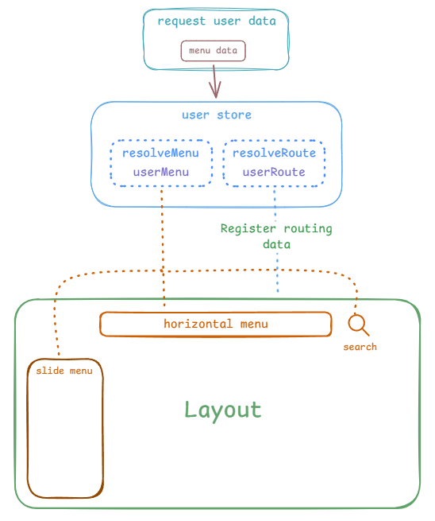

# 菜单路由

Lithe Admin 把菜单和路由的类型做了一点点的合并处理，使用 `MenuMixedOptions` 类型可以方便地进行菜单路由的数据配置。

## 数据结构

以现在的预览地址菜单数据为例：

```ts collapse
const menu: MenuMixedOptions[] = [
  {
    path: 'dashboard',
    name: 'dashboard',
    icon: 'mage:dashboard-chart-arrow',
    label: '仪表板',
    meta: {
      componentName: 'Dashboard',
      pinned: true,
    },
    component: 'dashboard/index',
  },
  {
    path: 'data-show',
    name: 'dataShow',
    label: '数据展示',
    icon: 'fluent:data-area-32-regular',
    redirect: 'data-show/data-table',
    children: [
      {
        path: 'data-table',
        name: 'dataTable',
        icon: 'ph:table',
        label: '数据表格',
        meta: {
          componentName: 'DataTable',
          title: '数据表格',
        },
        component: 'data-show/data-table/index',
      },
      {
        path: 'data-form',
        name: 'dataForm',
        icon: 'ph:article',
        label: '数据表单',
        meta: {
          componentName: 'DataForm',
          title: '数据表单',
        },
        component: 'data-show/data-form/index',
      },
    ],
  },
  {
    path: 'multi-level-menu',
    redirect: 'multi-level-menu/level-1',
    name: 'multiLevelMenu',
    icon: 'ph:list',
    label: '多级菜单',
    children: [
      {
        path: 'level-2-1',
        name: 'level-2-1',
        icon: 'ph:squares-four',
        label: '图标菜单',
        component: 'multi-level-menu/index',
      },
      {
        path: 'level-2-2',
        name: 'level-2-2',
        label: '无图标菜单',
        component: 'multi-level-menu/index',
      },
      {
        type: 'group',
        key: 'group-1',
        label: '分组',
        children: [
          {
            path: 'level-2-3',
            name: 'level-2-3',
            icon: 'ph:squares-four',
            label: '菜单2-3',
            component: 'multi-level-menu/index',
          },
          {
            type: 'divider',
            key: 'divider-1',
          },
          {
            path: 'level-2-4',
            name: 'level-2-4',
            icon: 'ph:squares-four',
            label: '不创建tab',
            component: 'multi-level-menu/index',
            meta: {
              showTab: false,
            },
          },
        ],
      },
      {
        path: 'level-2-5',
        name: 'level-2-5',
        redirect: 'level-2-5/level-2-1',
        icon: 'ph:squares-four',
        label: '三级菜单',
        children: [
          {
            path: 'level-3-1',
            name: 'level-3-1',
            icon: 'ph:squares-four',
            label: '菜单3-1',
            component: 'multi-level-menu/index',
          },
          {
            type: 'divider',
            key: 'divider-2',
          },
          {
            type: 'group',
            key: 'group-2',
            label: '分组',
            children: [
              {
                type: 'divider',
                key: 'divider-3',
              },
            ],
          },
          {
            path: 'level-3-2',
            name: 'level-3-2',
            label: '菜单3-2',
            icon: 'ph:squares-four',
            component: 'multi-level-menu/index',
          },
          {
            path: 'level-3-3',
            name: 'level-3-3',
            label: '禁用菜单',
            icon: 'ph:squares-four',
            component: 'multi-level-menu/index',
            disabled: true,
          },
        ],
      },
    ],
  },
  {
    path: 'dynamic-route/:id?/:name?',
    name: 'dynamicRoute',
    label: '动态路由',
    icon: 'material-symbols:dynamic-feed',
    meta: {
      componentName: 'DynamicRoute',
      enableMultiTab: true,
    },
    component: 'dynamic-route/index',
  },
  {
    path: 'feedback',
    name: 'feedback',
    label: '反馈组件',
    icon: 'ph:messenger-logo',
    meta: {
      componentName: 'Feedback',
    },
    component: 'feedback/index',
  },
  {
    path: 'drag-drop',
    name: 'dragDrop',
    icon: 'pixelarticons:drag-and-drop',
    label: '拖拽模块',
    meta: {
      componentName: 'DragDrop',
    },
    component: 'drag-drop/index',
  },
  {
    path: 'not-found-page-404',
    name: 'notfoundPage',
    icon: 'streamline-freehand:server-error-404-not-found',
    label: '404页面',
    meta: {
      componentName: 'notfoundPage404',
    },
    component: 'error-page/404',
  },
  {
    path: 'about',
    name: 'about',
    icon: 'ph:info',
    label: '关于项目',
    component: 'about/index',
  },
]
```

## 类型说明

```ts
interface MenuMixedOptions {
  path: string // 路由路径
  name: string // 路由名称
  icon?: string // 菜单图标
  type?: 'group' | 'divider' // 菜单类型
  label?: string // 菜单名称
  key?: string // 菜单唯一 key，没有则取 name | path
  redirect?: string // 重定向路径
  meta?: {
    icon?: string | (() => VNodeChild) // 菜单图标
    title?: string | (() => VNodeChild) // 菜单标题
    componentName?: string // 组件名称（用于 KeepAlive 缓存）
    pinned?: boolean // 是否固定标签栏
    showTab?: boolean // 是否显示标签栏
    keepAlive?: boolean // 是否缓存该路由组件
    enableMultiTab?: boolean // 是否允许重复显示标签栏
  }
  component: string // 组件路径（可省略 .vue 后缀）
  disabled?: boolean // 是否禁用菜单
  children?: MenuMixedOptions[] // 子菜单
}
```

`MenuMixedOptions` 类型由 `NMenu` 菜单组件的 `options` prop 类型和 vue router 路由的 `RouteRecordRaw` 类型合并而来。

在 `src/router/helper.ts` 中的 `resolveMenu` 和 `resolveRoute` 的方法用于解析提取菜单和路由的数据。

```ts
// resolveMenu(): MenuProps['options']
interface NMenuOptions {
  name: string
  icon?: () => VNodeChild
  type?: 'group' | 'divider'
  label?: () => VNodeChild
  key?: string
  disabled?: boolean
  children?: NMenuOptions[]
}

// resolveRoute(): RouteRecordRaw[]
interface RouteRecordRaw {
  path: string
  name: string
  redirect?: string
  meta?: {
    icon?: string
    title?: string
    componentName?: string
    pinned?: boolean
    showTab?: boolean
    keepAlive?: boolean
    enableMultiTab?: boolean
  }
  component: () => Promise<typeof import('*.vue')>
  children?: RouteRecordRaw[]
}
```

## Vue Router meta 类型

在 `src/router/helper.ts` 中，如果你需要对 vue router 的 meta 类型进行改动，可以修改 `CustomRouteMeta` 类型。

```ts [src/router/helper.ts]
export interface CustomRouteMeta {
  icon?: string
  title?: string
  componentName?: string
  pinned?: boolean
  showTab?: boolean
  enableMultiTab?: boolean
  keepAlive?: boolean
}
```

## 路由守卫

在 `src/router/guard.ts` 中，Lithe Admin 默认处理了路由守卫的一些常用逻辑处理。

```ts collapse [src/router/guard.ts]
export function setupRouterGuard(router: Router) {
  const userStore = useUserStore()

  const { cleanup } = userStore

  router.beforeEach(async (to, from) => {
    // 发布 beforeEach 事件，可以在跳转路由之前进行一些操作
    routerEventBus.emit({ type: 'beforeEach' })

    // 如果前往的是登录页面
    if (to.name === 'signIn') {
      // 没有 token，跳转到登录页面
      if (!userStore.token) {
        return
      } else {
        // 有 token，跳回当前的路由
        return from.fullPath
      }
    }

    // 没有 token
    if (!userStore.token) {
      // 清空所有用户数据，跳转到登录页面，传入前往的路由路径参数
      cleanup(to.fullPath)
      return
    }

    // 有 token，但还没有注册路由数据
    if (userStore.token && !router.hasRoute('layout')) {
      try {
        // 如果用户路由数据为空，清空所有用户数据并跳转到登录页面，防止无法跳转路由
        if (isEmpty(userStore.userRoute)) {
          cleanup()
          return
        }

        // 注册用户路由数据
        router.addRoute({
          path: '/',
          name: 'layout',
          component: Layout,
          // 访问 / 路由时，重定向到 /dashboard 路由
          redirect: '/dashboard',
          children: userStore.userRoute,
        })

        // 跳转到前往的路由路径
        return to.fullPath
      } catch (error) {
        console.error('Error resolving user menu or adding route:', error)
        // 路由跳转出错会清空所有用户数据，跳转到登录页面
        cleanup()
        return
      }
    }
  })

  router.beforeResolve(() => {})

  router.afterEach(() => {
    // 发布 afterEach 事件，在跳转路由之后进行一些操作
    routerEventBus.emit({ type: 'afterEach' })
  })
}
```

::: tip 为什么直接添加 `layout` 路由，而不是遍历添加路由数据？

大多数情况下，我们的路由数据都是在 `layout` 布局中，直接添加 `Layout` 一个路由数据，vue router 内部会自动处理 `children` 路由数据，使其数据结构更像是一颗树。

当执行退出的操作时，只需要执行 `router.removeRoute('layout')` 即可删除 `layout` 路由以及其子路由数据。

当然，这样的写法有一个小小小的缺点，在请求**返回的菜单数据不满足**的情况下，需要到 `src/stores/user.ts` 中添加对应的菜单数据。

```ts [src/stores/user.ts]
token.value = res.data.token
user.value = res.data
// 添加测试菜单 // [!code focus]
// [!code focus]
user.value.menu.push({
  path: 'test', // [!code focus]
  name: 'test', // [!code focus]
  label: '测试', // [!code focus]
  component: 'test/index', // [!code focus]
}) // [!code focus]
```

因为在 `src/router/index.ts` 基础的路由数据配置中，不需要写 `layout` 的路由数据，否则它应该是这样的

```ts [src/router/index.ts]
const routes: RouteRecordRaw[] = [
  // [!code focus]
  {
    path: '/', // [!code focus]
    name: 'layout', // [!code focus]
    component: Layout, // [!code focus]
    redirect: '/dashboard', // [!code focus]
    // [!code focus]
    children: [
      // [!code focus]
      {
        path: 'test', // [!code focus]
        name: 'test', // [!code focus]
        label: '测试', // [!code focus]
        component: 'test/index', // [!code focus]
      }, // [!code focus]
    ], // [!code focus]
  }, // [!code focus]
  { path: '/sign-in', name: 'signIn', component: () => import('@/views/sign-in/index.vue') },
  {
    path: '/:pathMatch(.*)*',
    name: 'errorPage',
    component: () => import('@/views/error-page/index.vue'),
  },
]
```

:::

---

##### 菜单路由数据流图

<div style="display: flex; justify-content: center;">
  
</div>

## Q&A

::: tip 菜单的图标怎么用？

菜单的图标支持**动态图标**和**静态图标**两种方式，一般的情况下菜单的数据是请求返回的，所以使用**动态图标**的写法，如果在菜单中使用**静态图标**，需要让 Tailwind CSS 扫描到对应的图标类名来生成对应的 `css` 样式，例如：

1. 在 `src/*` 下任意文件写有静态图标类名的文字（推荐写在注释中）

```ts
/**
 * ph--acorn
 * ph--address-book
 * ...
 */
```

2. 一个不在页面上显示的元素

```html
<span class="hidden ph--acorn ph--address-book"></span>
```

总之让 Tailwind CSS 扫描到对应的图标类名生成图标样式即可。
:::
